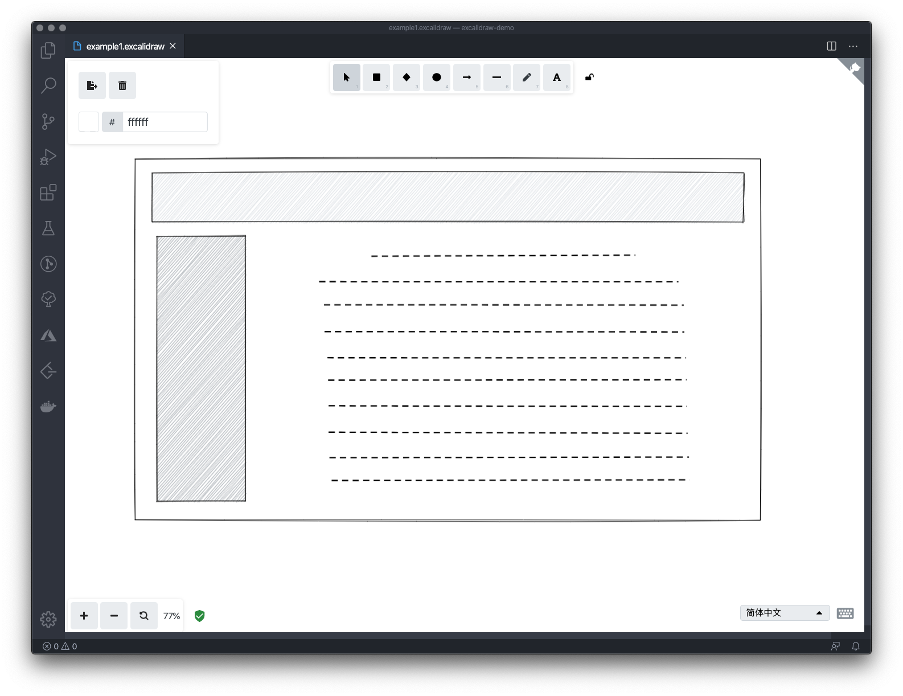

# vscode excalidraw plugin

The [Excalidraw](https://excalidraw.com/) plugin in VSCode

## install

[vscode-excalidraw-plugin](https://marketplace.visualstudio.com/items?itemName=jkchao.vscode-excalidraw-plugin)

## Features

- Edit `.excalidraw` file in editor
- Create `.excalidraw` file, and open it

## DEMO

### 1.Base

### 2.Export to PNG/SVG

<!-- TODO -->
